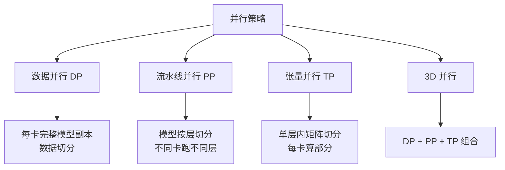

# 四种并行策略对比

## 一、Mermaid 对比图

## 二、对比表格

| 维度 | 数据并行 DP | 流水线并行 PP | 张量并行 TP | 3D 并行 |
|------|------------|--------------|-------------|---------|
| **切分对象** | 训练数据 | 模型层 | 单层权重矩阵 | 三者组合 |
| **每卡内存** | 完整模型副本 | 1/N 层 | 1/N 权重 | 按维度组合切分 |
| **计算效率** | 高（并行度高） | 中（有空泡 bubble） | 高（但通信密集） | 高（综合优势） |
| **通信开销** | 中（梯度 all-reduce） | 低（只传边界激活） | 高（每层都通信） | 高（多维度通信） |
| **通信频率** | 每步 1 次 | 每 micro-batch 1 次 | 每层前向+反向 | 多层多次 |
| **适用场景** | 模型能装下单卡 | 模型层数多 | 单层超大 | 超大规模模型 |
| **代表实现** | PyTorch DDP | GPipe / PipeDream | Megatron-LM | Megatron-DeepSpeed |

## 三、每种策略的内存 / 效率 / 通信详解

### 数据并行（DP）
- **内存**：每卡持有完整模型 + 优化器状态，显存占用 = 单卡最大
- **效率**：计算并行度高，但受限于单卡显存上限
- **通信**：每步 all-reduce 梯度，通信量与参数量成正比

### 流水线并行（PP）
- **内存**：模型按层切到 N 卡，每卡 1/N 层
- **效率**：由于流水线填充/排空，存在 bubble，效率 ≈ N/(N+1)
- **通信**：只在层边界传激活，通信量小

### 张量并行（TP）
- **内存**：单层权重按维度切到 N 卡，每卡 1/N
- **效率**：计算效率高，但每层都要通信
- **通信**：每层前向 + 反向都需要 all-reduce，通信密集

### 3D 并行
- **内存**：三个维度组合切分，单卡显存最小
- **效率**：综合优势，适合千亿参数模型
- **通信**：多维度通信，需要高速互联（NVLink / InfiniBand）